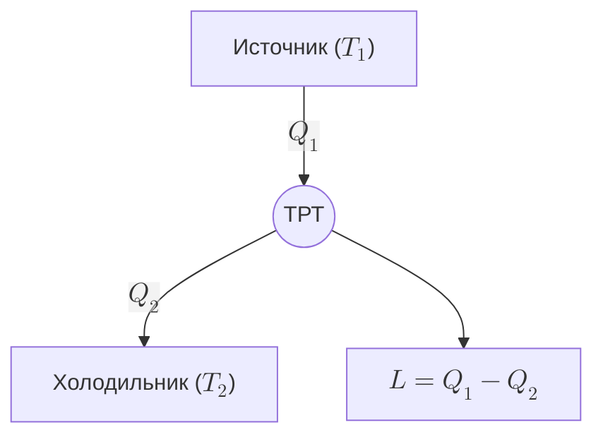

$$\huge pv^\gamma=const = C$$
$$\huge p_1v_1=p_2v_2^\gamma$$
### Прямые и обратные циклы

### Цикл карно.
Термический КПД цикла Карно не может быть равен 1, т.к. для этого необходимо чтобы $T_2  = 0$ либо $T_1 = \infty$, что невозможно.
### Обратный цикл Карно
$$ \Large L_ц = Q_1 - Q_2 \qquad \frac{Q_2}{Q_1}=\frac{T_2}{T_1}$$
$$\Large L = Q_2\frac{T_1}{T_2}-Q_2=Q_2\left(\frac{T_2}{T_2}-1\right)=Q_2\frac{T_1-T_2}{T_2}$$
### Необратимый цикл Карно
$$\Huge \eta_{t\text{ необр.}} < \eta_{t\text{ обр.}}$$

$$\Huge \eta_{t\text{ необр.}} = \frac{Q_1-Q_2}{Q_2} \qquad \eta_{t\text{ обр.}} = \frac{T_1-T_2}{T_2}$$
$$\Huge \frac{Q_1-Q_2}{Q_2} < \frac{T_1-T_2}{T_2}$$
$$\huge \frac{Q_1-Q_2}{Q_2} = \frac{T_1-T_2}{T_2} - \text{Карно}$$
### Свойства обратимых и необратимых циклов
$$\Large 1 - \frac{Q_2}{Q_1} = 1 - \frac{T_2}{T_1}; \qquad \frac{Q_2}{Q_1} = \frac{T_2}{T_1}; \qquad \frac{Q_2}{Q_1} - \frac{T_2}{T_1} = 0;$$
$$\large \frac{Q_1}{T_1}+ \frac{Q_2}{T_2} = 0 \qquad \sum\frac{Q}{T} = 0$$
$$ \Large \sum_I^n = \frac{\Delta Q_1^i}{T_1^i} = \sum_I^n = \frac{\Delta Q_2^i}{T_2^i} = 0$$
$$\Large \sum\frac{Q}{T} = 0 - \text{Карно обр.}$$
$$\Large \sum\frac{\Delta Q}{T} = 0 - \text{Произв обр.}$$$$\Large \sum\frac{Q}{T} < 0 - \text{Карно необр.}$$
$$\Large \sum\frac{\Delta Q}{T} < 0 - \text{Произв необр.}$$
